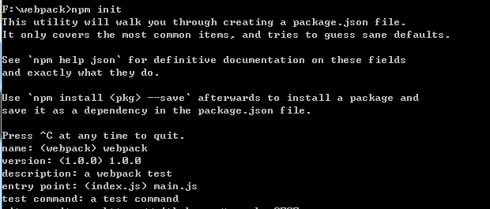
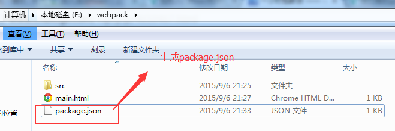
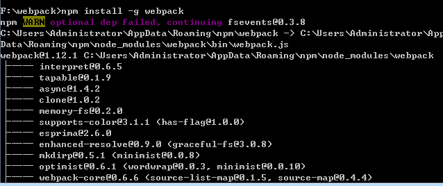

# 一：什么是webpack? 他有什么优点？
### 首先对于很多刚接触webpack人来说，肯定会问webpack是什么？它有什么优点？我们为什么要使用它？带着这些问题，我们来总结下如下：
### Webpack是前端一个工具，可以让各个模块进行加载，预处理，再进行打包，它能有Grunt或Gulp所有基本功能。优点如下：

* 1.支持commonJS和AMD模块。
* 2.支持很多模块加载器的调用，可以使模块加载器灵活定制，比如babel-loader加载器，该加载器能使我们使用ES6的语法来编写代码。
* 3.可以通过配置打包成多个文件，有效的利用浏览器的缓存功能提升性能。
* 4.使用模块加载器，可以支持sass，less等处理器进行打包且支持静态资源样式及图片进行打包。
* 5.更多等等。。。带着这些问题我们慢慢来学习webpack。

# 二：如何安装和配置
首先我的项目目录结构是：文件名叫webpack，里面只有一个main.html，代码如下：

```javascript

<!doctype html>
<html lang="en">
 <head>
  <meta charset="UTF-8">
  <title>Document</title>
  <script src="src/react.min.js"></script>
 </head>
 <body>
    <div id="content"></div>
    <script src="build/build.js"></script>
 </body>
</html>

```

还有一个文件夹src，该文件夹存放了二个js文件；react.min.js源文件和main.js文件，main.js源码如下：

```javascript

/* 内容区模块代码 */
var ContentMode = React.createClass({
        render: function(){
            return (
                <div className="ContentMode">
                    <div class="contents">{this.props.contents}</div>
                    {this.props.children}
                </div>
            )
        }
});
/* 页面div封装 上面三个模块 */
var Page = React.createClass({
    render: function(){
        return (
            <div className="homepage">
                <ContentMode  contents ="longen">this is one comment</ContentMode >
                <ContentMode  contents ="longen2">this is two comment</ContentMode >
            </div>
            )
        }
});
/* 初始化到content容器内 */
React.render(
       React.createElement(Page,null),document.getElementById("content")
);

```
该代码是React.js代码，是react.js入门学习一中的代码复制过来的 为了演示；

## 安装步骤如下：
> 1. 生成package.json文件；

首先我们需要在根目录下生成package.json文件，需要进入项目文件内根目录下执行如下命令：npm init


如上通过一问一答的方式后会在根目录下生成package.json文件，如下所示：


> 2.通过全局安装webpack

执行命令如下：npm install -g webpack 如下所示：

在c盘下会生成node_modules文件夹中会包含webpack，此时此刻我们可以使用webpack命令了；

> 3.配置webpack

每个目录下都必须有一个webpack.config.js，它的作用就好比Gulpfile.js、或者 Gruntfile.js，就是一个项目配置，告诉webpack需要做什么。

如下是我的webpack.config.js代码如下：

```javascript

module.exports = {
  entry: "./src/main.js",
  output: {
    filename: "build/build.js"
  },
  module: {
    loaders: [
       //.css 文件使用 style-loader 和 css-loader 来处理
      { test: /\.css$/, loader: "style!css" },
      //.js 文件使用 jsx-loader 来编译处理
      { test: /\.js$/,    loader: "jsx-loader" }
    ]
  },
  resolve: {
    extensions: ['', '.js', '.jsx']
  },
  plugins: []
};

```

##entry## 是页面中的入口文件，比如我这边的入口文件时main.js

##output:## 是指页面通过webpack打包后生成的目标文件放在什么地方去，我这边是在根目录下生成build文件夹，该文件夹内有一个build.js文件；

resolve: 定义了解析模块路径时的配置，常用的就是extensions; 可以用来指定模块的后缀，这样在引入模块时就不需要写后缀，会自动补全。

plugins: 定义了需要使用的插件，比如commonsPlugin在打包多个入口文件时会提取公用的部分，生成common.js;

module.loaders：是文件的加载器，比如我们之前react需要在页面中引入jsx的js源码到页面上来，然后使用该语法，但是通过webpack打包后就不需要再引入JSXTransformer.js；看到上面的加载器；比如jsx-loader加载器就是代表JSXTransformer.js的，还有style-loader和css-loader加载器；因此在使用之前我们需要通过命令把它引入到项目上来；因此需要如下命令生成下；

jsx-loader加载器 npm install jsx-loader --save-dev 如下：